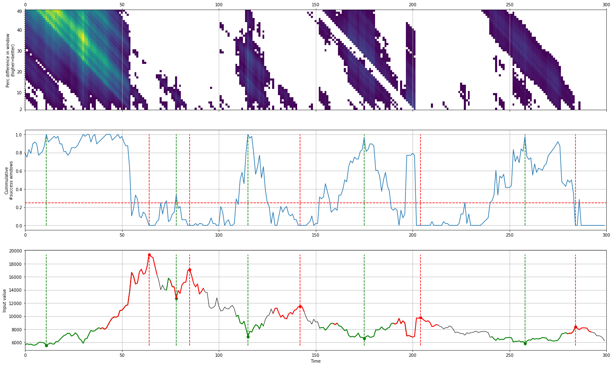
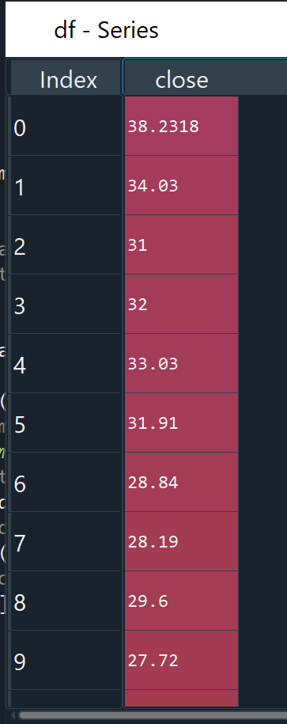
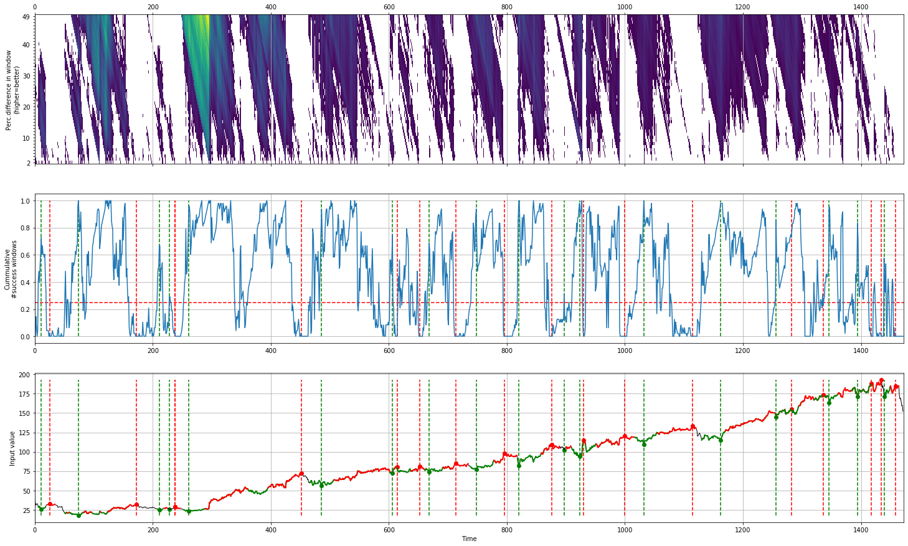
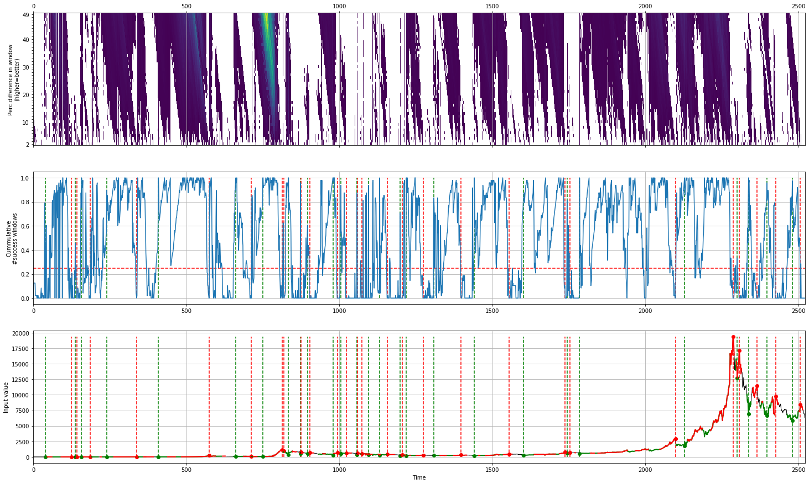
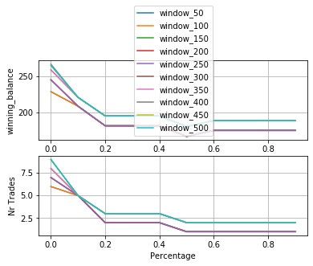

# CAERUS
[](https://img.shields.io/pypi/pyversions/caerus)
[](https://pypi.org/project/caerus/)
[](https://github.com/erdogant/caerus/blob/master/LICENSE)
[](https://pepy.tech/project/caerus/week)
[](https://erdogant.github.io/donate/?currency=USD&amount=5)

Detection of local minima with the corresponding local maxima within the given time-frame.

Caerus is a python package that detects points in time that are most probable local minima and local maxima. As an example is shown the last 300 days of BTC. Green are the local minima and red are the local maxima.
<p align="center">
  
</p>

This package determines the local-minima with the corresponding local-maxima across time series data without the need of normalization procedures. The method is designed with a forward rolling window where thousands of variable and sliding windows are iteratively evaluated by means of percentage difference (start-to-stop position). The resulting matrix contains N=windows X M=length_dataframe. The windows of interest have a score (percentage) larger then a predefined minimum. The final matrix is then aggregated (sum) per time-point and normalized for the window length (at the end of the time series data, the windows are forced to become smaller). At each time point the score ranges between [0,1], where [0] depicts that no single window contained a desired minimum percentage, and [1] depicts that all windows showed the minimum desired window. The local minima regions of interest are subsequently detected by thresholding. The stop-locations are determined based on the distance and percentage of te start-locations. As an example, if you want to have best regions, use threshold=1, minperc=high and nlargest=1 (small).

### About the name
In Greek mythology, Caerus (same as kairos) was the personification of opportunity, luck and favorable moments. 
He was shown with only one lock of hair. His Roman equivalent was Occasio or Tempus. Caerus was the youngest child of Zeus.

## Contents
- [Installation](#%EF%B8%8F-installation)
- [Quick Start](#-quick-start)
- [Contribute](#-contribute)
- [Citation](#-citation)
- [Maintainers](#-maintainers)
- [License](#-copyright)

## Installation
* Install caerus from PyPI (recommended). caerus is compatible with Python 3.6+ and runs on Linux, MacOS X and Windows. 
It is distributed under the Apache 2.0 license.

```
pip install caerus
```
* Alternatively, install caerus from the GitHub source:

```bash
git clone https://github.com/erdogant/caerus.git
cd caerus
python setup.py install
```  

## Quick Start
- Import caerus method

```python
import caerus as cs
```

- Simple example with constant window, minimum percentage and threshold
```python
df=pd.read_csv('https://github.com/erdogant/caerus/blob/master/caerus/data/fb.csv')['close']
out = cs.fit(df)
fig = cs.makefig(out)
```
The input is a pandas dataframe or series and looks like this:
<p align="left">
  
</p>
The output looks as below:
<p align="center">
  
</p>


```python
df=pd.read_csv('https://github.com/erdogant/caerus/blob/master/caerus/data/btc.csv')['Close']
out = cs.fit(df)
fig = cs.makefig(out)
```
The output looks as below:
<p align="center">
  
</p>


- Gridsearch walks over the windows and over the percentages to determine optimal window, minimum percentage and the threshold.
```python
df = pd.read_csv('https://github.com/erdogant/caerus/blob/master/caerus/data/btc.csv')['close']
out = cs.gridsearch(df)
```

The output looks as below:
<p align="center">
  
</p>


## Citation
Please cite caerus in your publications if this is useful for your research. Here is an example BibTeX entry:
```BibTeX
@misc{erdogant2019caerus,
  title={caerus},
  author={Erdogan Taskesen},
  year={2019},
  howpublished={\url{https://github.com/erdogant/caerus}},
}
```

## Maintainers
* Erdogan Taskesen, github: [erdogant](https://github.com/erdogant)

## © Licence
See [LICENSE](LICENSE) for details.

## Donation
* This work is created and maintained in my free time. If this package brings you good stuff, you can support me by donating.
[](https://erdogant.github.io/donate/?currency=USD&amount=5)
