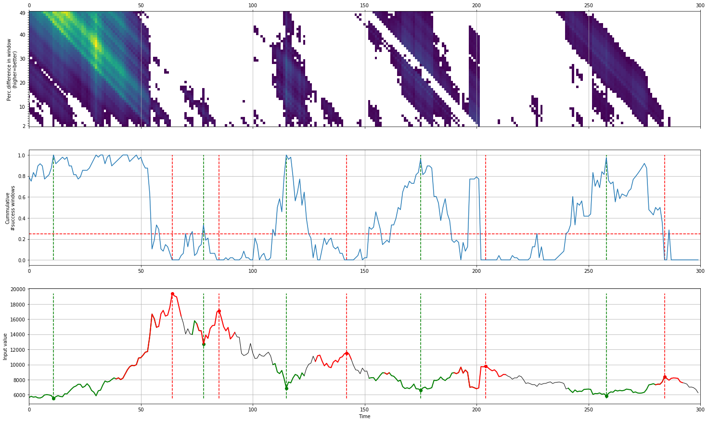

caerus's documentation!
==============================

``caerus`` is Python package to compute the local-minima with the corresponding local-maxima within the given time-frame.
This approach is designed to for stock-market valley and peak detection.

**Here are just a few of the things that caerus does well:**

	* Detects peaks and valleys in complex trends.
	* Insightful plots. 
	* Parameter gridsearch.
	* Designed for trend movements such as as in stockmarket data.

.. table:: Bitcoin
   :align: center

   +----------+
   | |fig1|   |
   +----------+

Content
=======

.. toctree::
   :maxdepth: 1
   :caption: Background
   
   Background

.. toctree::
   :maxdepth: 1
   :caption: Installation
   
   Installation

.. toctree::
  :maxdepth: 1
  :caption: Tutorials

  Tutorials

.. toctree::
  :maxdepth: 1
  :caption: Examples

  Examples

.. toctree::
  :maxdepth: 1
  :caption: Documentation
  
  Documentation
  Coding quality
  caerus.caerus

* :ref:`genindex`

Quick install
-------------

.. code-block:: console

   pip install caerus

Github
------------------------------

Please report bugs, issues and feature extensions there.
Github, `erdogant/caerus <https://github.com/erdogant/caerus/>`_.

Citing *caerus*
-----------------------

The bibtex can be found in the right side menu at the `github page <https://github.com/erdogant/caerus/>`_.

Sponsor this project
------------------------------

If you like this project, **Star** this repo at the github page and become a **sponsor**!
Read more why this is important on my sponsor page. The **sponsor button** will direct you to the sponsor github page.

.. raw:: html

	<iframe src="https://github.com/sponsors/erdogant/button" title="Sponsor erdogant" height="35" width="116" style="border: 0;"></iframe>

Indices and tables
==================

* :ref:`genindex`
* :ref:`modindex`
* :ref:`search`

.. raw:: html

	

	

		
	

	

